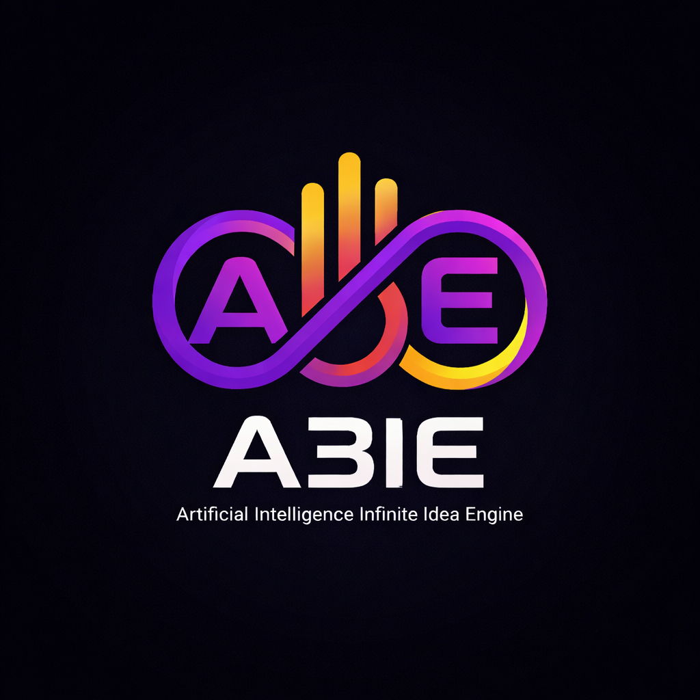

# A3IE: Artificial Intelligence Infinite Idea Engine




A3IE (Artificial Intelligence Infinite Idea Engine) is a **multi-AI orchestration framework** for generating **high-quality, evidence-based system ideas** from real-world news, reports, and official announcements.

Instead of relying on a single AI model, A3IE coordinates **8 different LLMs in parallel** across multiple stages (news collection → analysis → insight extraction → idea generation → evaluation) to produce one final, user-verified idea per run.

> Think of A3IE as a *daily multi-AI “idea foundry”* that turns the world’s changing signals into new system concepts.

---

## ✨ Core Principles

1. **Synergy Through Integration**  
   The outputs of multiple AIs at each step are **merged and fed forward** to the next stage. This cross-pollination allows diverse perspectives to interact, rather than compete in isolation.

2. **Minimal Standardization, Maximum Diversity**  
   A3IE defines **only minimal roles and output constraints**. Over-standardization suppresses each AI’s unique strengths and style; diversity is treated as a feature, not noise.

3. **Abundance Over Scarcity**  
   If multiple high-quality final candidates appear, that is a **successful outcome**. In an era where AI can produce at scale, **“too many good ideas” is a good problem**.

4. **Multi-Expert Advantage**  
   Traditional workflows assume distinct human specialists. LLMs are **multi-domain generalists with different tendencies**. A3IE explicitly systematizes this “many generalists” landscape.

5. **Tool-Agnostic Design**  
   Automation tools, agents, and platforms change almost daily. A3IE therefore focuses on **concepts and process**, not specific tools.  
   - You are expected to adapt automation to your own setup (MCP, agents, scripts, etc.).
   - The specification is intentionally lightweight and portable.

---

## 🧩 High-Level Workflow

A3IE is built as a **7-step pipeline**, executed with **8 AIs in parallel** at several stages.

1. **STEP 1 – News Collection**  
2. **STEP 2 – Domain Analysis**  
3. **STEP 3 – Insight Extraction**  
4. **STEP 4 – Insight Combination → System Ideas**  
5. **STEP 5 – Top-3 Selection per AI**  
6. **STEP 6 – Cross-AI Global Selection**  
7. **STEP 7 – Final User Verification & Archiving**

At the end of one full run, you obtain **one “final idea of the day”**, plus all intermediate artifacts (`news.md`, `industry_trend.md`, `insight.md`, `system_design.md`, `candidate_idea.md`, `final_idea.md`) for later reuse.

---

## 📁 Suggested Repository Structure

```bash
A3IE/
├─ A3IE_en.md
├─ A3IE_ko.md
├─ prompts/
│  ├─ step1_news_collection.md
│  ├─ step2_domain_analysis.md
│  ├─ step3_insight_extraction.md
│  ├─ step4_system_ideas.md
│  ├─ step5_top3_selection.md
│  └─ step6_final_selection.md
└─ README.md
```

---

## 🤝 Contributing

1. Fork this repository.
2. Propose:
   - new prompt variants,
   - automation scripts,
   - folder structures or visualizations,
   - or case studies of real A3IE runs.
3. Open a Pull Request with:
   - a clear description,
   - sample outputs,
   - and any limitations you observed.

---

## 📜 License

MIT

---

## 👤 Author

**Jung Wook Yang**  
Email: `sadpig70@gmail.com`  
GitHub: https://github.com/sadpig70
